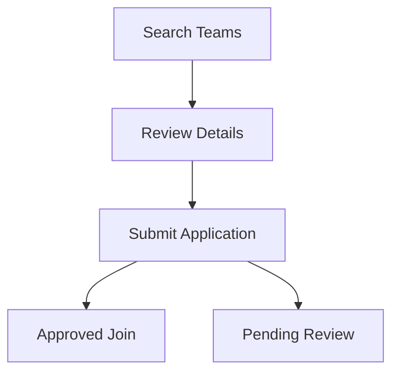

## Overview

Zwift Community provides a central hub for cyclists to connect, compete, and grow. You can discover teams, join events, discuss strategies in forums, and share tips with fellow riders. These core features make it easy to engage deeply with the Zwift ecosystem.

<Columns cols={3}>
  <Card title="Teams" icon="users" href="#teams">
    Find and join teams that match your riding style and goals.
  </Card>
  <Card title="Events" icon="calendar" href="#events">
    Participate in races, group rides, and community meetups.
  </Card>
  <Card title="Forums & Chats" icon="message-circle" href="#forums">
    Connect with others through discussions and live chats.
  </Card>
</Columns>

## Discovering and Joining Teams

Teams in Zwift Community bring riders together for motivation and shared goals. Browse categories like racing, endurance, or casual riding to find the perfect fit.

<Steps>
  <Step title="Search Teams" icon="search">
    Visit the Teams page and filter by skill level, location, or activity type.
  </Step>
  <Step title="Review Details" icon="eye">
    Check team stats, recent activities, and member reviews.
  </Step>
  <Step title="Join" icon="check-circle">
    Click `Join Team` and complete the short application form.
  </Step>
</Steps>

<Callout kind="tip">
  Most teams approve applications within 24 hours. Introduce yourself in the welcome chat to get started quickly.
</Callout>



## Participating in Community Events

Events range from competitive races to social rides. Sign up early as popular ones fill quickly.

<Tabs>
  <Tab title="Races" icon="flag">
    Competitive events with leaderboards. Register via the Events calendar.

    <Image
      src="https://images.unsplash.com/photo-1558618047-3c8c76ca8e47?ixlib=rb-4.0.3&ixid=M3wxMjA3fDB8MHxwaG90by1wYWdlfHx8fGVufDB8fHx8fA%3D%3D&auto=format&fit=crop&w=1000&q=80"
      alt="Zwift race event screenshot"
      width="800"
      height="450"
    />
  </Tab>
  <Tab title="Group Rides" icon="bike">
    Casual rides for all levels. Follow the route and chat with participants.
  </Tab>
  <Tab title="Workouts" icon="dumbbell">
    Structured sessions led by coaches. Ideal for training goals.
  </Tab>
</Tabs>

## Interacting in Forums and Chats

Stay connected through dedicated spaces for discussion.

<Tabs>
  <Tab title="Forums" icon="layout">
    Post threads on gear reviews, training plans, or Zwift updates. Use tags like `#training` or `#gear` for visibility.
  </Tab>
  <Tab title="Live Chats" icon="message-circle">
    Join team-specific or event chats. React with emojis and share routes in real-time.
  </Tab>
</Tabs>

<Expandable title="Advanced Chat Features" default-open="false">
  Pin important messages, create polls for event planning, or schedule recurring rides.
</Expandable>

## Sharing Resources and Tips

Contribute to the community by uploading routes, workout files, or tips.

<CodeGroup tabs="Zwift (.zwo),Strava (.fit)">
```xml
<?xml version="1.0" encoding="UTF-8"?>
<workoutfile>
  <author>Killer Workout Creator</author>
  <description>Endurance Builder</description>
  <warmup duration="600" power="0.65"/>
</workoutfile>
```
```text
FIT file for Strava upload:
- Intervals: 4x5min at 95% FTP
- Recovery: 3min easy spin
Download from community resources.
```
</CodeGroup>

<Callout kind="success">
  Shared resources earn badges and increase your community reputation.
</Callout>

<Columns cols={2}>
  <Card title="Next Steps" icon="arrow-right" href="/quickstart">
    Start with a team or event today.
  </Card>
  <Card title="Get Help" icon="help-circle" href="/faq">
    Browse FAQs or contact support.
  </Card>
</Columns>