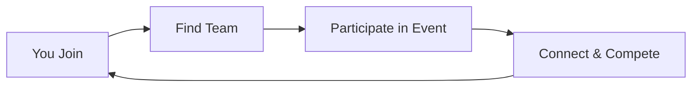

<Callout kind="info" title="Starter Kit Template">
  This documentation was generated as a starter kit template based on your brand. Please review and customize the content to accurately reflect your product's features, APIs, and capabilities.
</Callout>

## Overview

Welcome to the Zwift Community hub. You connect with fellow cyclists and runners, discover teams, and join exciting events all in one place. This platform enhances your Zwift experience by fostering community engagement and friendly competition.

Zwift Community serves as the central destination for Zwift users. You explore teams tailored to your fitness level and interests, participate in virtual races and group rides, and build connections that extend beyond the app.

## Key Features

Discover the core capabilities that make Zwift Community thrive.

<Columns cols={3}>
  <Card title="Teams" icon="users" href="/teams">
    Join or create teams for cyclists and runners. Compete in leagues and track progress together.
  </Card>
  <Card title="Events" icon="calendar" href="/events">
    Participate in scheduled races, workouts, and social rides. Something for every skill level.
  </Card>
  <Card title="Connections" icon="share-2" href="/connections">
    Chat, share routes, and collaborate. Build your network within the Zwift world.
  </Card>
</Columns>

## Quick Start

Get up and running in minutes. Follow these steps to dive into the community.

<Steps>
  <Step title="Sign Up" icon="user-plus">

    Create your account using Zwift credentials.

    <CodeGroup tabs="JavaScript,Python">
      ````javascript
      const response = await fetch('https://api.example.com/auth/login', {
        method: 'POST',
        headers: { 'Content-Type': 'application/json' },
        body: JSON.stringify({ email: 'your@email.com', password: 'YOUR_PASSWORD' })
      });
      ````

      ````python
      import requests
      response = requests.post('https://api.example.com/auth/login', json={
          'email': 'your@email.com',
          'password': 'YOUR_PASSWORD'
      })
      ````
    </CodeGroup>

  </Step>
  <Step title="Find a Team" icon="search">

    Browse teams by sport or level.

    Visit `https://api.example.com/teams` to list available options.

  </Step>
  <Step title="Join an Event" icon="play-circle">

    Select from upcoming events and register.

    Confirm your spot via the dashboard at `https://dashboard.example.com/events`.

  </Step>
</Steps>

## Benefits for You

Engaging with Zwift Community brings clear advantages:

- **Motivation Boost**: Team challenges keep you consistent.
- **Skill Improvement**: Events provide structured training.
- **Social Fun**: Connect with like-minded athletes worldwide.

<Callout kind="tip">
  Start with a beginner event to ease in.
</Callout>

## Navigation Guide

Quickly access what you need.

<Tabs>
  <Tab title="Cyclists" icon="activity">
    Focus on road races and hill climbs. Check `/events#cycling` for schedules.
  </Tab>
  <Tab title="Runners" icon="shoe-prints">
    Join trail runs and marathons. See `/events#running` for details.
  </Tab>
  <Tab title="Teams" icon="shield">
    Filter by `{skillLevel}`: beginner, intermediate, advanced.
  </Tab>
</Tabs>

Ready to explore? Head to the [Quickstart](/quickstart) for deeper setup or [Authentication](/authentication) for secure access.

