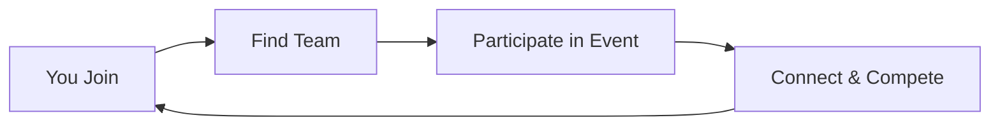

## Overview

You're not built like the Zwift benchmark. Neither are we. This is your central support hub for everything Zwift Community—designed to help you connect, compete, and gear up on your own terms.&#x20;

## Choose your destination

How can we help you ride today?

<Columns cols="3">
  <Card title="Zwift Community" href="/community" icon="users" horizontal="false" target="_self">
    Join or create teams for cyclists and runners. Compete in leagues and track progress together.
  </Card>

  <Card title="Zwift Games" href="/games" icon="bike" horizontal="false" target="_self">
    Participate in scheduled races, workouts, and social rides. Something for every skill level.
  </Card>

  <Card title="OWL.BiKe" href="/store" icon="lucide-shopping-cart" horizontal="false" target="_self">
    Chat, share routes, and collaborate. Build your network within the Zwift world.
  </Card>
</Columns>

## Quick Start

Get up and running in minutes. Follow these steps to dive into the community.

<Steps>
  <Step title="Sign Up" icon="user-plus" title-type="p">
    Create your account using Zwift credentials.

    <CodeGroup show-lines="true">
      ```javascript
      const response = await fetch('https://api.example.com/auth/login', {
        method: 'POST',
        headers: { 'Content-Type': 'application/json' },
        body: JSON.stringify({ email: 'your@email.com', password: 'YOUR_PASSWORD' })
      });
      ```

      ```python
      import requests
      response = requests.post('https://api.example.com/auth/login', json={
          'email': 'your@email.com',
          'password': 'YOUR_PASSWORD'
      })
      ```
    </CodeGroup>
  </Step>

  <Step title="Find a Team" icon="search" title-type="p">
    Browse teams by sport or level.

    Visit `https://api.example.com/teams` to list available options.
  </Step>

  <Step title="Join an Event" icon="play-circle" title-type="p">
    Select from upcoming events and register.

    Confirm your spot via the dashboard at `https://dashboard.example.com/events`.
  </Step>
</Steps>

## Benefits for You

Engaging with Zwift Community brings clear advantages:

- **Motivation Boost**: Team challenges keep you consistent.
- **Skill Improvement**: Events provide structured training.
- **Social Fun**: Connect with like-minded athletes worldwide.

<Callout kind="tip" collapsed="false">
  Start with a beginner event to ease in.
</Callout>

## Navigation Guide

Quickly access what you need.

<Tabs>
  <Tab title="Cyclists" icon="activity">
    Focus on road races and hill climbs. Check `/events#cycling` for schedules.
  </Tab>

  <Tab title="Runners" icon="shoe-prints">
    Join trail runs and marathons. See `/events#running` for details.
  </Tab>

  <Tab title="Teams" icon="shield">
    Filter by `{skillLevel}`: beginner, intermediate, advanced.
  </Tab>
</Tabs>

Ready to explore? Head to the [Quickstart](/quickstart) for deeper setup or [Authentication](/authentication) for secure access.

